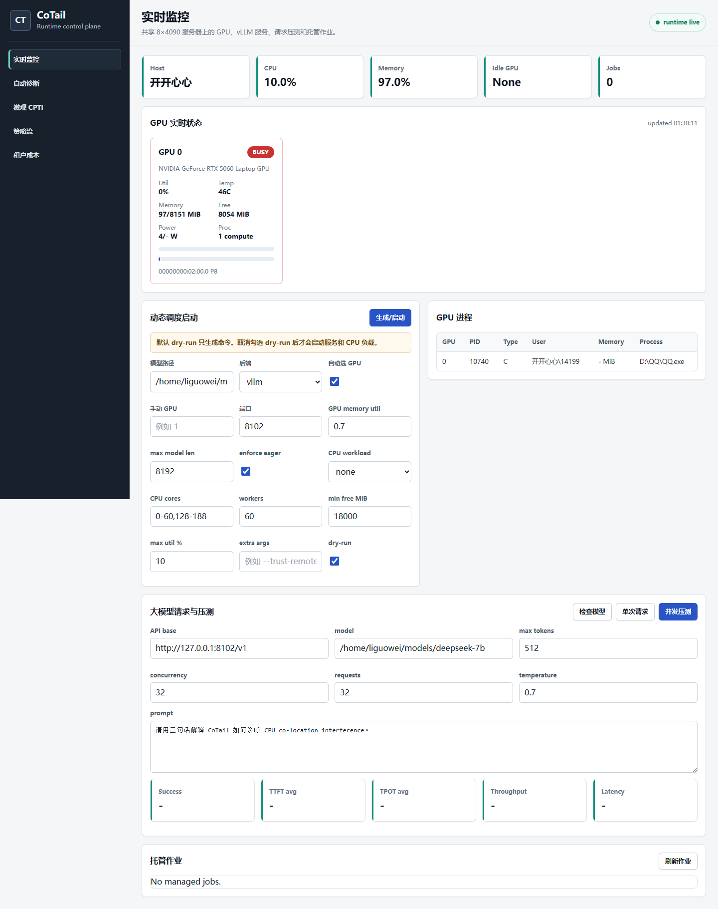
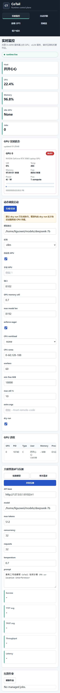

# CoTail Visual System

CoTail Visual System is a browser-based control plane for measurement-driven diagnosis and mitigation of host-CPU co-location interference in single-GPU LLM serving. It turns the CoTail workflow into a live system: GPU/resource monitoring, vLLM service launch, CPU co-tenant workload control, macro canary benchmarking, CPTI stage analysis, policy recommendation, and tenant-cost inspection.

The project is intentionally independent from paper artifact folders. It is packaged as a reproducible FastAPI + static frontend application that can run on a Linux multi-GPU server.

## Interface Preview

Desktop runtime console:



Responsive mobile layout:



## Features

- Real-time GPU, GPU-process, CPU, memory, and managed-job monitoring.
- Idle GPU selection for single-GPU serving on shared multi-GPU machines.
- vLLM/SGLang/llama-server launch command generation, with dry-run enabled by default.
- OpenAI-compatible LLM request and benchmark panel with TTFT, TPOT, latency, success rate, and throughput.
- Managed CPU co-tenant workload launch, stop, health probe, orphan scan, and cleanup.
- Baseline / Co-location / Protected macro measurement workflow.
- Nsight Systems SQLite import for vLLM NVTX stage tail analysis.
- CPTI, CTS, dominant-stage detection, and CoTail policy recommendation.
- Manual policy override panels for RT, NUMA, cgroup, and nice-based protection plans.
- Tenant and diagnostic-overhead views for cost-aware operational decisions.

## Repository Layout

```text
backend/          FastAPI backend, CoTail logic, workload runners, tests
web/              Static HTML/CSS/JS frontend
docs/             Source-logic map and Chinese operation manual
deploy/           Lightweight start/stop/status scripts
requirements.txt  Runtime Python dependencies
requirements-dev.txt  Test dependencies
```

## Quick Start

Use Python 3.10+.

```bash
git clone <your-repo-url>
cd cotail_visual_system

python3 -m venv .venv
source .venv/bin/activate
python -m pip install --upgrade pip
python -m pip install -r requirements.txt

python -m uvicorn backend.app.main:app --host 127.0.0.1 --port 8899
```

Open:

```text
http://127.0.0.1:8899
```

For a shared Linux GPU server:

```bash
python -m uvicorn backend.app.main:app --host 0.0.0.0 --port 8899
```

Then open:

```text
http://<server-ip>:8899
```

## Running With An Existing vLLM Environment

If vLLM is installed in a separate environment, run CoTail with that Python or expose the vLLM binary through `PATH`.

Example for the 8x4090 server:

```bash
export COTAIL_PYTHON=/home/liguowei/vllm_env/vllm/bin/python
export COTAIL_EXTRA_PATH=/home/liguowei/vllm_env/vllm/bin
export COTAIL_PORT=8899

./deploy/start.sh
./deploy/status.sh
```

Stop:

```bash
./deploy/stop.sh
```

You can also copy `.env.example` to `.env` and load it before running the scripts.

## Tests

```bash
python -m pip install -r requirements-dev.txt
pytest backend/tests -q
```

## Operational Notes

- The launch page is dry-run by default. Uncheck `dry-run` only after confirming the selected GPU and command preview.
- Process discovery, CPU affinity changes, RT scheduling, and workload cleanup should run as the same Linux user that owns the target vLLM service.
- Some protection actions require Linux permissions such as `CAP_SYS_NICE` or suitable cgroup access.
- `nvidia-smi` is required for full GPU monitoring.
- Nsight trace parsing expects an exported SQLite file from Nsight Systems.

## Security Warning

This console can start/stop model-serving processes, spawn CPU stress workloads, scan local processes, and apply scheduling protections. Do not expose it directly to the public internet without authentication and network controls. For demos, prefer VPN, SSH tunnel, or an Nginx reverse proxy with Basic Auth.

## Documentation

- Chinese operation manual: `docs/操作手册.md`
- Source logic map: `docs/source_logic_map.md`
